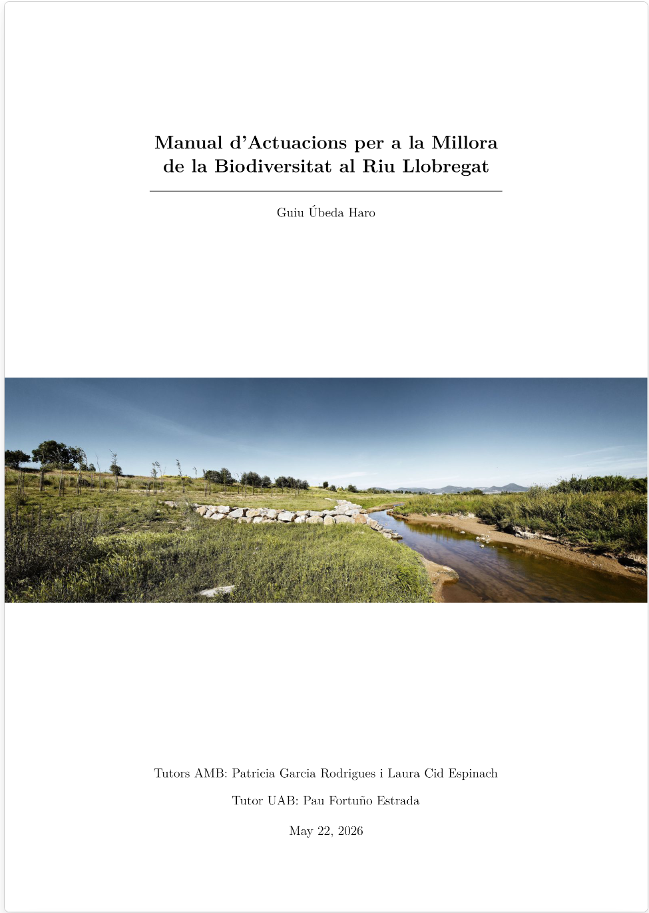

# Manual d'actuacions Llobregat

Aquest repositori recull els materials generats en el treball **Catàleg d’actuacions per millorar la biodiversitat en l’entorn fluvial del Llobregat**, desenvolupat en col·laboració amb l’Àrea Metropolitana de Barcelona (AMB).

L’objectiu del repositori és facilitar la consulta del **Manual d’actuacions**, la **memòria metodològica**, la **base de dades ecològica** i els **mapes d’idoneïtat** elaborats com a primera aproximació per orientar actuacions de millora de la biodiversitat al riu Llobregat.

---

## Manual d'actuacions

El manual recull una primera proposta d’actuacions per afavorir la biodiversitat en l’entorn fluvial del Llobregat. Inclou mesures generals i actuacions vinculades a diferents grups faunístics, especialment papallones i pol·linitzadors, avifauna i rèptils.

  

---

## Memòria del treball

La memòria explica el procés de desenvolupament del catàleg: context, objectius, metodologia, criteris de selecció d’espècies, reestructuració de la base de dades, generació dels mapes d’idoneïtat i limitacions del treball.

  

---

## Mapes d'idoneïtat

Els mapes d’idoneïtat són ràsters generats mitjançant eines GIS a partir de variables ambientals, territorials i ecològiques. S’han creat com una **primera aproximació espacial** per identificar àrees potencialment favorables per a diferents espècies.

  

### Com interpretar els mapes

Els mapes tenen valors normalitzats d’idoneïtat entre **0 i 100**:

- valors baixos indiquen menor idoneïtat relativa segons les variables utilitzades;
- valors alts indiquen zones potencialment més favorables;
- no s’han d’interpretar com a mapes de distribució real de les espècies;
- cal contrastar-los amb informació de camp, dades actualitzades i criteri tècnic abans d’utilitzar-los per definir actuacions definitives.

### Limitacions principals

Els mapes són útils com a eina preliminar de diagnosi i planificació, però presenten limitacions:

- Depenen de la qualitat i escala de les capes cartogràfiques disponibles;
- Actualment, no tots incorporen microhàbitats importants, com murs de pedra seca, refugis, cavitats o qualitat real de les basses. Alguns grups, com amfibis, ratpenats o rèptils terrestres, requereixen variables més específiques per millorar la fiabilitat dels resultats;
- No substitueixen la validació de camp;
- La fiabilitat dels mapes estar afectats per biaixos en les dades de presència utilitzades en l'analisis estadistic
---

## Contingut principal del repositori

| Carpeta / apartat | Contingut | Ús principal |
|---|---|---|
| [`Documents`](./Documents) | Manual, documents metodològics i materials de suport | Consultar els documents finals i la metodologia del projecte |
| [`Base de dades`](./Base%20de%20dades) | Base de dades, glossari de camps, criteris d’espècies i documents associats | Consultar o ampliar la informació ecològica estructurada |
| [`assets`](./assets) | Imatges i recursos visuals del repositori | Recursos auxiliars de presentació |
| [Releases](https://github.com/ubedaguiu-sys/Manual-Actuacions-Llobregat/releases) | Mapes d’idoneïtat i versions descarregables | Descarregar materials pesants o versions empaquetades |

---

## Metodologia resumida

El treball s’ha desenvolupat a partir de sis blocs principals:

1. **Benchmarking de manuals i guies existents**  
   Revisió de documents tècnics sobre biodiversitat, restauració, hàbitats fluvials, pol·linitzadors, avifauna, fauna urbana i gestió d’espais oberts.

2. **Reestructuració de la base de dades**  
   Adaptació d’una base de dades prèvia de l’AMB cap a un model relacional més funcional, amb taules per a espècies, grups, hàbitats CORINE, propostes, plantes, basses, calendari i manteniment.

3. **Selecció i revisió d’espècies**  
   Incorporació i revisió d’espècies d’interès per al context del Llobregat, incloent en la base de dades, per a posteriorment orientar les propostes d'acctuació, aquelles espècies indicadores, funcionals, en regressió, exòtiques invasores o potencialment problemàtiques.

4. **Recopilació d’informació ecològica**  
   Cerca bibliogràfica sobre hàbitats, requeriments ecològics de les especies, amenaces, relació amb el medi, pressions antròpiques i possibilitats de gestió...

5. **Generació de mapes d’idoneïtat**  
   Elaboració de mapes ràster mitjançant QGIS/PyQGIS a partir de variables com hàbitats CORINE, NDVI, ecotons, connectivitat, basses, murs, edificis, arbustos i altres capes territorials.

6. **Disseny de propostes d’actuació**  
   Traducció de la informació ecològica i territorial en actuacions concretes per orientar futures intervencions de millora de la biodiversitat.

---

## Nombre Espècies i grups treballats

Els mapes d’idoneïtat generats corresponen a diferents grups faunístics:

| Grup faunístic | Nombre d'espècies amb mapa |
|---|---:|
| Amfibis | 8 |
| Mamífers no quiròpters | 11 |
| Aus | 15 |
| Rèptils | 11 |
| Ratpenats | 4 |
| Papallones | 7 |
| **Total** | **56** |

---

## Propostes d'actuació

El manual planteja actuacions orientades a millorar la biodiversitat del riu Llobregat i el seu entorn metropolità. Les propostes aborden, entre altres àmbits:

- seguiment i gestió de fauna invasora o problemàtica;
- gestió de colònies felines en espais sensibles;
- creació d’una xarxa connectada d’hàbitats per a papallones;
- millora i creació de jardins modulars per a papallones;
- control o eliminació de flora problemàtica en espais prioritaris;
- seguiment d’agents químics en zones pròximes a cultius;
- adaptació d’edificis i estructures per a la fauna;
- reducció de col·lisions d’aus amb edificis i infraestructures;
- instal·lació de pantalles de deflexió de vol;
- millora d’illes fluvials;
- adaptació de talussos de nidificació;
- rehabilitació i adaptació de murs de pedra seca.

Algunes actuacions disposen d’una primera proposta cartogràfica o zonificació associada. Aquestes delimitacions s’han d’entendre com a punts de partida per a una revisió tècnica posterior.

---

## Base de dades

La base de dades és un dels elements centrals del projecte. Permet estructurar informació sobre:

- espècies;
- grups faunístics;
- hàbitats CORINE;
- relació de les espècies amb el medi;
- fonts d’informació;
- propostes d’actuació;
- espècies beneficiades per cada proposta;
- calendari i manteniment;
- plantes d’interès;
- basses i punts d’aigua.

La base s’ha reorganitzat en un model relacional per reduir redundàncies i facilitar consultes creuades entre espècies, hàbitats, propostes i criteris ecològics.

---

## Recomanacions d'ús

Aquest repositori pot ser útil per a:

- consultar el manual d’actuacions;
- revisar el procés metodològic seguit;
- descarregar els mapes d’idoneïtat;
- entendre quins criteris ecològics s’han utilitzat;
- ampliar la base de dades amb noves espècies o propostes;
- utilitzar els materials com a suport preliminar per a estudis o actuacions futures.

Abans d’utilitzar els mapes o les propostes per a decisions de gestió, es recomana:

1. revisar la memòria metodològica;
2. consultar la base de dades i els criteris associats;
3. comprovar si hi ha versions més recents a les releases;
4. validar els resultats amb treball de camp;
5. contrastar la viabilitat amb els equips tècnics responsables de l’espai.

---

## Estat dels materials

Aquest repositori recull una **primera versió** dels materials generats. Alguns documents, mapes o fitxers poden ser revisats i actualitzats posteriorment.

Per això, es recomana utilitzar sempre les versions publicades a l’apartat de **Releases** quan es vulgui descarregar la memòria o els mapes d’idoneïtat.

---

## Autoria i context

Treball desenvolupat en el marc del **Treball de Final de Grau en Biologia Ambiental**.

- Autor: Guiu Úbeda Haro  
- Tutor acadèmic: Pau Fortuño Estrada  
- Entitat col·laboradora: Àrea Metropolitana de Barcelona  
- Tutores de l’entitat: Patricia Rodríguez i Laura Cid Espinach  
- Curs: 2025-2026  

---

## Avís

Els materials d’aquest repositori tenen una finalitat tècnica, acadèmica i de suport a la planificació ambiental. Les propostes i mapes no substitueixen estudis específics, projectes executius, informes ambientals reglats ni validacions de camp.
